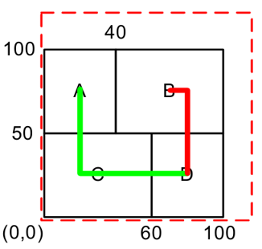
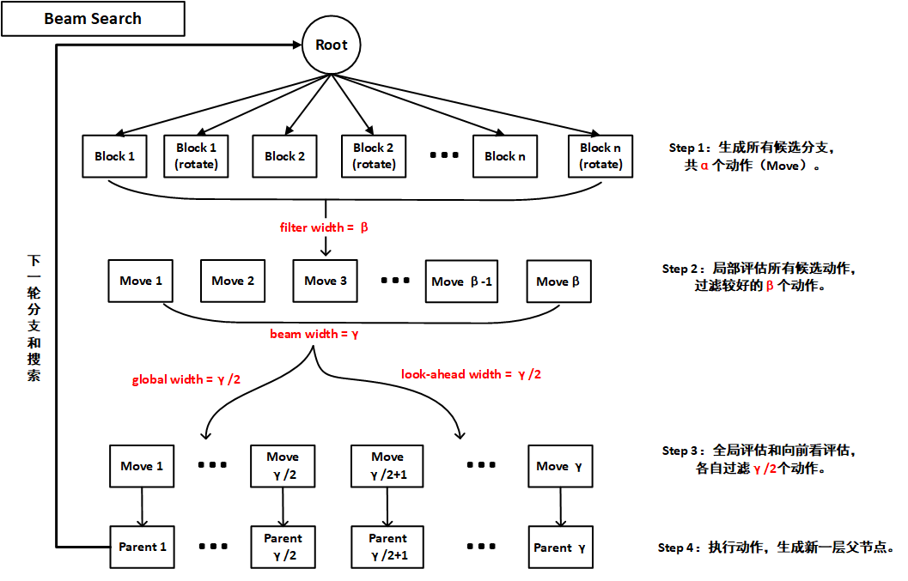
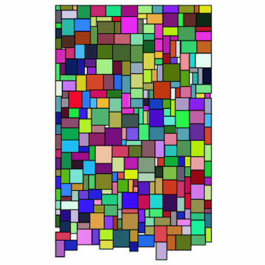

# SmartVLSI

## 问题描述

布图规划（Floorplan）问题描述：为每个（硬）模块选择合适的形状和位置，以使得全局边界框面积 $area(F)$ 和总线长的 $L(F)$ 加权和最小化，即
$$
\min \{\alpha \cdot \operatorname{area}(F) + (1-\alpha) \cdot L(F)\}, \quad 0 \leq \alpha \leq 1
$$
其中，总线长 $L(F)$ 估算为模块 $i$、$j$ 之间连接度 $c_{ij}$ 和其中心点曼哈顿距离 $d_M(i,j)$ 的乘积：
$$
L(F)=\sum_{i, j \in F} c_{i j} \cdot d_{M}(i, j)
$$

## 两层搜索框架

上层：**自适应选择搜索（ASA，Adaptive selection approach）** 的目标在于找到一个有潜力的包络矩形长度；

下层：**集束搜索（BS，Beam search）** 则是为了找到一个合理的放置顺序。

    

## 算例改进

详见 [BestResult](Deploy/BestResult.md)。

## 排版效果展示

